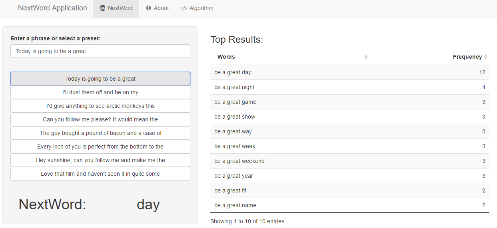

NextWord Application
========================================================
author: Douglas Wirtz
date: October 3rd, 2016

**Data Science Specialization: JHU on Coursera**

About the Application
========================================================
This simple application allows the user to input a 
phrase and the application will predict the next word
in the phrase.

The next word in the phrase is predicted using an
algorithm developed from an English corpus of blog, twitter, and
news entries that can be downloaded [here](https://d396qusza40orc.cloudfront.net/dsscapstone/dataset/Coursera-SwiftKey.zip).

In order to improve performance, a random 5% sample of each document
was taken from the corpus was merged to build the algorithm. The 
trade-off of sampling is a reduction in accuracy.

Some exploratory analysis was performed on the sample. The 
details can be found in the [milestone report](http://rpubs.com/dswirtz/milestone).

About the Algorithm
========================================================

To develop the algorithm, a [Katz back-off](https://en.wikipedia.org/wiki/Katz%27s_back-off_model)
model approach was used. This process involves these steps:

- Sample and clean the corpus
- Divide the corpus into 4, 3, 2, 1-word tokens (n-grams) and 
sort by their frequencies
- To predict the next word, input a phrase and the algorithm will search 
4-grams for the last three words
- If a 4-gram cannot be found, the algorithm will back-off to search
the 3-grams for the last two words in the phrase
- If a 3-gram cannot be found, the algorithm will back-off to search 
the 2-grams for the last word in the phrase
- If a 2-gram cannot be found, then highest frequency 1-gram is predicted

How to Use NextWord Application
========================================================

This application was built with the intention of predicting the next word in a phrase. 

The features of this application include:
- An input box that allows the user to type any desired phrase
- After a brief delay, the next likely word in the phrase is predicted
- A data table with the top predicted results limited to a maximum of 10 
- Option to select 1 of 8 preset phrases
- An "About" tab that provides basic information
- An "Algorithm" tab that gives the code used for data processing and algorithm development

Give it a Try!
========================================================

Check out the application [here](https://dswirtz.shinyapps.io/NextWord_App/)! 

Please enjoy the application, and feel free to send any comments to dougwirtz@gmail.com.

