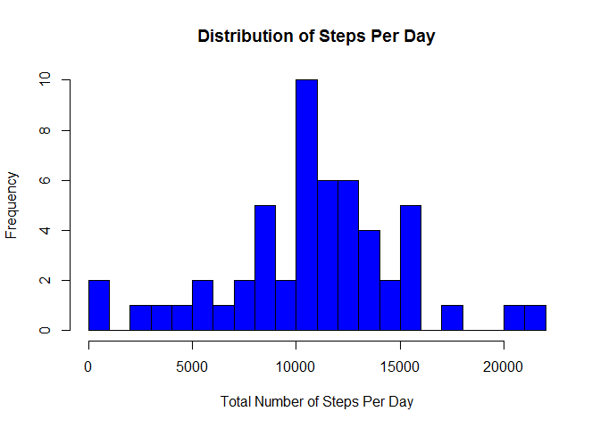
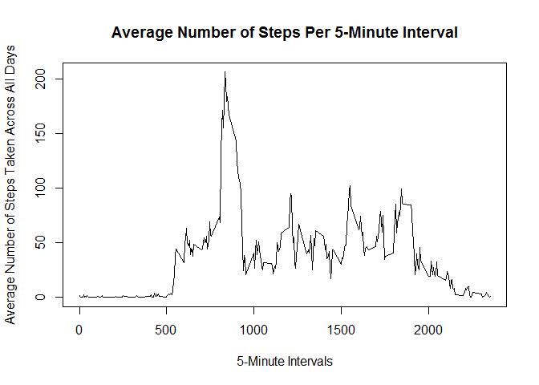
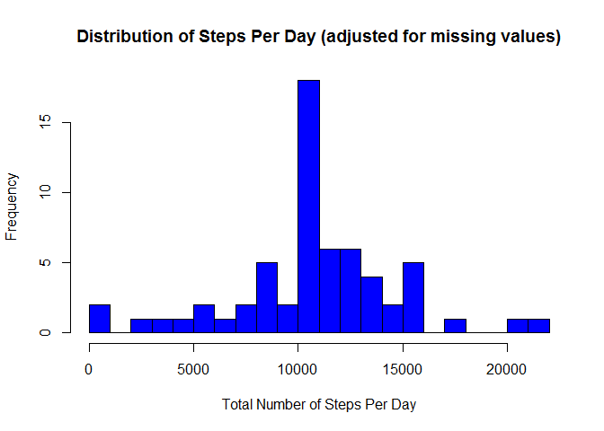
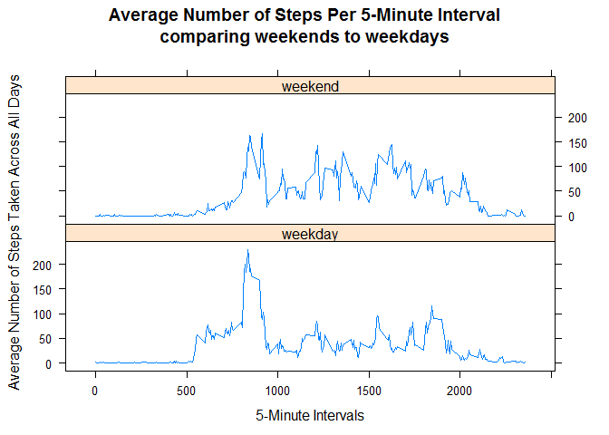

# Reproducible Research: Peer Assessment 1


## Loading and preprocessing the data
The raw data for this assignment was downloaded and extracted into the
current working directory: 

"C:/Users/Douglas/Desktop/DataScience/reproducible research project 1"

Read in the Data

```r
data <- read.csv("activity.csv", na.strings = "NA")
data$steps <- as.integer(data$steps)
data$date <- as.Date(data$date)
data$interval <- as.integer(data$interval)
head(data)
```

```
##   steps       date interval
## 1    NA 2012-10-01        0
## 2    NA 2012-10-01        5
## 3    NA 2012-10-01       10
## 4    NA 2012-10-01       15
## 5    NA 2012-10-01       20
## 6    NA 2012-10-01       25
```
Subset the data without "NA" observations

```r
data_sub <- subset(data, !is.na(data$steps))
head(data_sub)
```

```
##     steps       date interval
## 289     0 2012-10-02        0
## 290     0 2012-10-02        5
## 291     0 2012-10-02       10
## 292     0 2012-10-02       15
## 293     0 2012-10-02       20
## 294     0 2012-10-02       25
```

## What is mean total number of steps taken per day?
Plot the distribution ignoring missing values

```r
StepsPerDay <- tapply(data_sub$steps, data_sub$date, sum)
hist(StepsPerDay, col = "blue", breaks = 20,
     xlab = "Total Number of Steps Per Day", ylab = "Frequency",
     main = "Distribution of Steps Per Day")
```

\
Calculate mean and median of total number of steps taken per day

```r
mean(StepsPerDay)
```

```
## [1] 10766.19
```

```r
median(StepsPerDay)
```

```
## [1] 10765
```
## What is the average daily activity pattern?
Plot the average number of steps taken per 5-minute interval

```r
AvgStepsInterval <- aggregate(steps ~ interval, data_sub, mean)
plot(AvgStepsInterval$interval, AvgStepsInterval$steps, type = "l",
     xlab = "5-Minute Intervals",
     ylab = "Average Number of Steps Taken Across All Days",
     main = "Average Number of Steps Per 5-Minute Interval")
```

\
Find the 5-minute interval where the number of steps reaches a max,
on average across all days

```r
MaxSteps <- max(AvgStepsInterval$steps)
AvgStepsInterval[AvgStepsInterval$steps == MaxSteps, ]
```

```
##     interval    steps
## 104      835 206.1698
```
The maximum number of steps is 206.1698 at interval 835

## Imputing missing values
Calculate total number of missing values (coded as "NA") in dataset

```r
sum(is.na(data$steps))
```

```
## [1] 2304
```
Create a new dataset that is equal to the original, but with missing
data filled in ("NA" is replaced with the mean of that 5-minute interval)

```r
data_adj <- data
MissingData <- is.na(data_adj$steps)
AvgInt <- tapply(data_sub$steps, data_sub$interval, mean)
data_adj$steps[MissingData] <- AvgInt[as.character(data_adj$interval[MissingData])]
head(data_adj)
```

```
##       steps       date interval
## 1 1.7169811 2012-10-01        0
## 2 0.3396226 2012-10-01        5
## 3 0.1320755 2012-10-01       10
## 4 0.1509434 2012-10-01       15
## 5 0.0754717 2012-10-01       20
## 6 2.0943396 2012-10-01       25
```
Plot the distribution adjusting for the missing values

```r
AdjStepsPerDay <- tapply(data_adj$steps, data_adj$date, sum)
hist(AdjStepsPerDay, col = "blue", breaks = 20,
     xlab = "Total Number of Steps Per Day", ylab = "Frequency",
     main = "Distribution of Steps Per Day (adjusted for missing values)")
```

\
Calculate mean and median of total number of steps taken per day of adjusted dataset

```r
mean(AdjStepsPerDay)
```

```
## [1] 10766.19
```

```r
median(AdjStepsPerDay)
```

```
## [1] 10766.19
```
After imputing the missing values with the mean of that 5-minute interval,
the mean of the dataset didn't change. The median, however, increased slightly.
The cause of this is due to the fact that the imputed values were means of steps
at 5-minute intervals. This will cause there to be a higher frequency
of days that have the average number of steps per day. As for the median,
with an increase in frequency at the average number of steps, the closer
the median will get to mean. In this case, the mean and median of the adjusted
dataset are equal.

## Are there differences in activity patterns between weekdays and weekends?
Create two new factors, weekday and weekend

```r
weekend <- weekdays(as.Date(data_adj$date)) %in% c("Saturday", "Sunday")
data_adj$DayOfWeek <- "weekday"
data_adj$DayOfWeek[weekend == TRUE] <- "weekend"
data_adj$DayOfWeek <- as.factor(data_adj$DayOfWeek)
head(data_adj)
```

```
##       steps       date interval DayOfWeek
## 1 1.7169811 2012-10-01        0   weekday
## 2 0.3396226 2012-10-01        5   weekday
## 3 0.1320755 2012-10-01       10   weekday
## 4 0.1509434 2012-10-01       15   weekday
## 5 0.0754717 2012-10-01       20   weekday
## 6 2.0943396 2012-10-01       25   weekday
```
Make a plot to compare the average number of steps taken, averaged across
all weekdays or weekends

```r
AvgStepsIntervalByFactor <- aggregate(steps ~ interval + DayOfWeek,
                                      data_adj, mean)
library(lattice)
xyplot(steps ~ interval | DayOfWeek, AvgStepsIntervalByFactor,
       type = "l", layout = c(1,2), xlab = "5-Minute Intervals", 
       ylab = "Average Number of Steps Taken Across All Days",
       main = "Average Number of Steps Per 5-Minute Interval\ncomparing weekends to weekdays")
```

\
